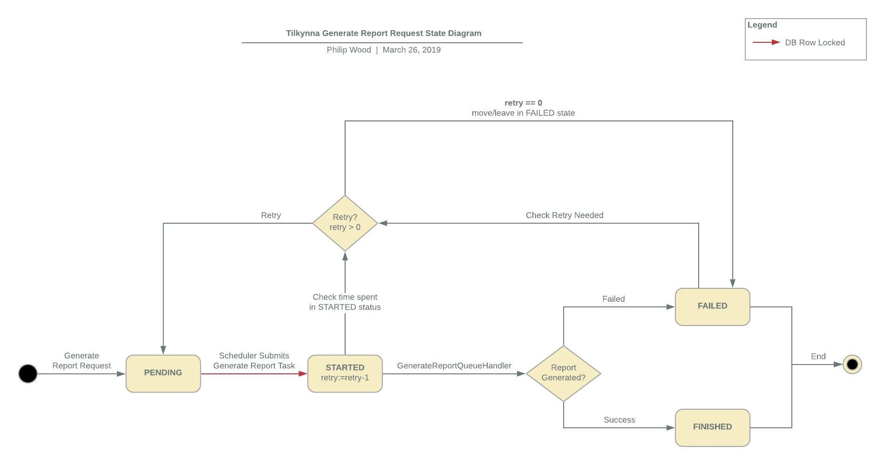

# Report Generation Functionality

Reports are generated off an internal queue, implemented via a DB table, to ensure persistence of queue. 

The `generated_report` holds all data related to report requests. This includes

- details of what was requested for the report (when, who, what)
- The status of the request (as seen below in the State Diagram). Can be:
  - **PENDING**: Your request for a report has been received but no processing of the report has started yet. 
  - **STARTED**: Generation of the report has started and is currently in progress.
  - **FAILED**: Something has gone wrong with the generation of the report, try again or contact admin. 
  - **FINISHED**: Generation of report has finished, and for a request made to a downloadable destination you can download this report 




**How 'Report Requests' move through the above states:**

- Report Requests are done via the API using the: 
  ​	TemplateGenerateRemoteRequest `/templates/{templateId}/generate` endpoint

- This will be recorded in `generated_report` table with a `PENDING` status

- The `GenerateReportQueueScheduler` monitors the `generated_report` table  for 3 statuses, namely:

  - **PENDING**: to initiate the report generation process
  - **FAILED**: to check if an retry might be needed, and move report request to PENDING again
  - **STARTED**: to check if there are any long running reports 

- The schedule's for above monitors can be configured in your application.yaml 

  ```yaml
  tilkynna:
    ...
    generate: 
      ...
      monitorPendingRequests: 
        fixedRateInMilliseconds: 1000
        initialDelayInMilliseconds: 5000
      monitorFailedRequests: 
        fixedRateInMilliseconds: 1000
        initialDelayInMilliseconds: 5000
      monitorStalledRequests: 
        fixedRateInMilliseconds: 1000
        initialDelayInMilliseconds: 5000
  ```

  Where:
    **fixedRateInMilliseconds:** is always the fixed period in milliseconds between invocations for a specified monitor's schedule. 

    **initialDelayInMilliseconds:** is always the time milliseconds to delay before the first execution of for a specified monitor's schedule after server startup.

  and Where: 
    **monitorPendingRequests:** relates to the scheduler for enquiring pending report requests

    **monitorFailedRequests:** relates to the scheduler for checking if failed requests need to be retried or not

    **monitorStalledRequests:**  relate to the scheduler for checking if there are any requests stuck in the STARTED status 

- The number of retries which the server will do can also be  configured in your application.yaml

  ```yaml
  tilkynna:
    generate: 
      retry: 
        maxAttempts: 3
        backOffPeriodInMilliseconds: 5000
  ```

  Where:
     **maxAttempts:**  is the number of retries that will be done
     **backOffPeriodInMilliseconds:** is the amount of time in milliseconds that the server will wait before attempting the report generation again on one that previously failed. 

